# Weaveit rebrand + phased HN parity

## Current state (honest)

This app is a **Vite + React 19 SPA** that only loads **Top** stories from the HN Firebase API. Nav tabs are dead `#` links, sidebar search/topics/jobs are **hardcoded placeholders**, comments/users link out to real HN. There is no router.

**Cannot be done against official HN** (read-only Firebase API): upvote, login, submit, reply, flag, favorites on the real site. Those phases use **local-only** features and/or **“open on HN”** deep links so nothing pretends to write to HN.

**Can be done fully in-app:** Top/New/Best/Ask/Show/Jobs feeds, **dynamic right sidebar**, comment trees, **Algolia public HN API** search, user profiles (read), better UX than classic HN.

Brand destination URL stays `[https://weavedb.app](https://weavedb.app)` unless you later provide a Weaveit URL.

---

## Phase 1 — Weaveit branding + logo (no behavior changes)

**Goal:** All user-facing WeaveDB → **Weaveit**; logo after title text and in the bottom-right pill.

1. Copy the provided logo into `[public/weaveit-logo.png](public/weaveit-logo.png)` (from the Cursor assets image already attached).
2. `[Header.jsx](src/components/Header.jsx)`: change `by WeaveDB` → `by Weaveit`; add `` **immediately after** the title span (keep the orange `Y` tile as HN mark).
3. `[WeaveDBButton.jsx](src/components/WeaveDBButton.jsx)` (+ CSS): replace Lucide `Database` with the logo image; text → `Weaveit`; title → `Powered by Weaveit`. Optionally rename component/files to `WeaveitButton` for consistency.
4. `[Footer.jsx](src/components/Footer.jsx)`: brand text + logo → Weaveit.
5. `[index.html](index.html)`: title → `Hacker News by Weaveit`.
6. Logo CSS: fixed height (~20–24px navbar, ~18–20px pill); `filter: invert(1)` (or equivalent) under `[data-theme="dark"]` so the black line-art stays visible on dark surfaces.

**Done when:** light/dark both show a visible logo in header + FAB; no remaining “WeaveDB” / “Weave AI” UI strings.

---

## Phase 2 — Layout bug + clear UI fixes

**Goal:** Left layout is a stable side-by-side feed; no nested-container wars; obvious polish bugs gone.

Root causes of “main sticks above” in `[App.css](src/App.css)` / `[Sidebar.css](src/components/Sidebar.css)` / `[StoryList.jsx](src/components/StoryList.jsx)`:

- 2-column grid at `min-width: 1000px` but sidebar hidden only below `900px` → **901–999px** stacks feed above sidebar.
- Nested `.container` on both `.main-layout` and `StoryList`’s `<main>`; `.layout-left .container` hits every nested container.

**Fixes:**

1. Unify breakpoint (e.g. **1000px** everywhere): grid + sidebar visibility.
2. One content shell: keep `.container` on `.main-layout` only; remove inner `.container` from `StoryList` / avoid double max-width.
3. Left layout: center the wide shell (`margin: 0 auto; max-width: 1400px`) so it doesn’t pin flush-left oddly under the sticky header.
4. Other quick fixes in the same phase:
  - Dark-theme skeleton colors in `[index.css](src/index.css)`
  - User-visible fetch error state (not only `console.error`)
  - Persist theme + layout in `localStorage`
  - Consistent `target`/`rel` on external links

**Done when:** toggling left layout at desktop shows feed | sidebar side-by-side; mid widths either hide sidebar or keep 2-col consistently; no broken dark skeletons.

---

## Phase 3 — Routing + API foundation

**Goal:** Stable navigation base before more features (prevents thrash).

1. Add `react-router-dom`.
2. Routes: `/` (top), `/new`, `/best`, `/ask`, `/show`, `/jobs`, `/item/:id`, `/user/:id`, `/search`.
3. Expand `[api.js](src/api.js)`:
  - `fetchStoryIds(type)` → `topstories|newstories|beststories|askstories|showstories|jobstories`
  - Keep `fetchStory(id)`; add batched/concurrent fetch helper (e.g. limited `Promise.all` chunks) to cut N+1 wait
4. Lift feed type into route; Header nav links become `<NavLink>`s with real `active` state.
5. Pass `feed` into `StoryList`; reset page on feed change.

**Done when:** each nav tab loads the matching Firebase list; URLs are shareable; no regressions on Top.

---

## Phase 4 — Story list polish (parity for feeds)

**Goal:** Each feed behaves like a real reader.

1. Jobs/Ask items without URL → open in-app item page.
2. Rank numbers respect pagination offset.
3. Empty / error / retry UI per feed.
4. Add “Best” nav item (HN has it; currently missing from header).

**Done when:** Top/New/Best/Ask/Show/Jobs all work end-to-end with Load More.

---

## Phase 5 — Dynamic right sidebar (replaces fake widgets)

**Goal:** The right column in left-aligned layout feels alive—content changes with the current route and with live HN data. Delete hardcoded Stripe/OpenAI blurbs and static tags in `[Sidebar.jsx](src/components/Sidebar.jsx)`.

### Design (concrete)

Always show (when sidebar is visible):

1. **Search** — input UI now; submit navigates to `/search?q=…` (Algolia wired in Phase 7). Until then, Enter can still navigate with query in the URL so the route exists.
2. **Hot right now** — from the **currently loaded feed stories** (passed as props or small shared cache): top 5 by `score`, compact rows (title + points). Updates when the user changes Top/New/Best/etc. or loads more.
3. **Buzzing topics** — derive live tags from those story titles + domains (simple keyword/domain frequency, stopword filter). Clicking a tag goes to `/search?q=tag`. No hardcoded “rust / react” list.
4. **Who’s hiring** — fetch first ~5 items from `jobstories` (real titles + company-ish snippet from title). Link each to `/item/:id`. Refresh when entering left layout or on a light interval (e.g. when feed changes), not a fake list.

Route-aware swap (same sidebar shell, different third/fourth widget):

| Current route               | Extra / swapped widget                                                                                       |
| --------------------------- | ------------------------------------------------------------------------------------------------------------ |
| Feed pages (`/`, `/new`, …) | Hot + Topics + Jobs as above                                                                                 |
| `/jobs`                     | Hide duplicate Jobs widget; show **Latest Ask HN** (3 items from `askstories`) instead                       |
| `/item/:id`                 | **This thread** — score, comment count, author, age; optional “top-level comments” count once item is loaded |
| `/user/:id`                 | Compact user karma + “view submissions” (after Phase 8; until then omit)                                     |
| `/search`                   | Hide search box duplicate; show Hot from front page cache                                                    |

### Implementation notes

- Refactor `[Sidebar.jsx](src/components/Sidebar.jsx)` into small widgets (`HotNow`, `TopicCloud`, `LiveJobs`, `ThreadMeta`) under `src/components/sidebar/`.
- Prefer **reuse of already-fetched story objects** from the feed (lift a `storiesById` map or pass `visibleStories` from `StoryList` via App context) so Hot/Topics don’t double-fetch the whole page.
- Jobs widget: one dedicated `fetchStoryIds('job')` + batch fetch of 5 items; skeleton while loading; empty state if fail.
- Light motion: fade/slide widget body when route or feed type changes (2–3 intentional transitions, not noise).
- Keep sticky sidebar behavior; ensure widgets don’t blow past viewport height (scroll inside sidebar if needed).

**Done when:** left layout sidebar never shows fake company blurbs; Hot/Topics change when switching feeds; Jobs list matches real `jobstories`; item route shows thread meta.

---

## Phase 6 — In-app comment threads

**Goal:** Users stay on this site for discussion.

1. `ItemPage` at `/item/:id`: story header + recursive comment tree from `kids` via `fetchStory`.
2. Collapse/expand threads; indent + opacity for nesting; “dead”/deleted handling.
3. StoryItem comment count → `<Link to={`/item/${id}`}>` (stop bouncing to news.ycombinator.com for reading).
4. Lazy-load nested kids as needed if deep trees are heavy.
5. Footer action: “Open on Hacker News” for reply/vote (honest deep link).
6. Feed ThreadMeta sidebar widget with live item stats once this page exists.

**Done when:** clicking comments opens an in-app threaded view; collapse works; no blank deleted crashes.

---

## Phase 7 — Search (Algolia public HN API)

**Goal:** Make sidebar search and `/search` real using the **public Algolia Hacker News API**, which is the cheapest and easiest option for this HN reader.

### Why this shape

- No search server to run.
- No indexing or sync script to maintain.
- No API keys required for the public HN endpoints.
- Results already match Hacker News search expectations, which is ideal for parity.

### Implementation

1. Add a thin search helper in `[src/api.js](src/api.js)` or a dedicated `[src/searchApi.js](src/searchApi.js)` for:
  - `searchStories(query, page)`
  - optional `searchComments(query, page)` if comment search is added later
2. Use the public Algolia HN endpoint:
  - `https://hn.algolia.com/api/v1/search?query=...&tags=story`
  - optional comment mode later via `tags=comment`
3. Build `/search` page:
  - query from `?q=`
  - debounced input
  - result rows linking to `/item/:id` when we have the item route, or external article URL when appropriate
  - loading, empty, and error states
4. Wire Sidebar search + topic tags → `/search?q=…`.
5. Keep the implementation read-only and simple: no local search index, no backend companion.

### Nice-to-have polish inside the same phase

- Feed-aware fallback suggestions when query is empty
- Search result filters for `stories` first, with `comments` only if it stays lightweight
- Preserve query in the URL for shareable searches

**Done when:** typing a query returns real HN story results in-app from Algolia’s public API, with no extra search infrastructure to deploy.

---

## Phase 8 — User profiles (read-only)

**Goal:** In-app `/user/:id` from `https://hacker-news.firebaseio.com/v0/user/{id}.json`.

1. Show karma, about (sanitized HTML), created date.
2. List recent submissions (fetch items by id).
3. Author links in StoryItem / comments → in-app profile.
4. Optional compact user card in sidebar on profile routes.

**Done when:** author name navigates in-app; profile loads without errors.

---

## Phase 9 — “Better than real HN” differentiators (local / UX)

These are why people would prefer this UI **without** needing write access:

1. **Local library:** bookmark / hide stories (localStorage); optional “Saved” nav + **Saved** sidebar widget (count + last 3 titles).
2. **Reading UX:** density toggle, keyboard j/k navigation, focus mode for comment threads.
3. **Performance:** story cache, prefetch next page, skeleton that matches dark/light.
4. **Mobile:** solid nav + comment collapse; FAB doesn’t obscure Load More.
5. **SEO/meta:** update `[todo.md](todo.md)` items (`robots.txt`, better title/meta) if still deploying to Cloudflare Pages.
6. Keep Weaveit branding consistent on new pages.

**Skip pretending:** no fake upvote that claims to hit HN. Prefer: local “upvote for sorting my list” **or** deep-link “Vote on HN”.

**Done when:** at least bookmarks + keyboard nav + theme/layout persistence + Saved sidebar widget ship.

---

## Phase 10 — Write-adjacent honesty layer (optional last)

Only after read parity is solid:

- Per-story actions: Copy link / Open article / Open on HN / Save locally.
- Document in a short in-app About blurb: reader powered by Weaveit; voting/posting still on HN.

Do **not** build fake login/submit against Firebase.

---

## Execution discipline (avoid errors)

- One phase = one focused PR-sized change set; verify in browser before the next.
- After Phase 3, never hardcode only `fetchTopStories`.
- Prefer extending existing components (`[Header](src/components/Header.jsx)`, `[StoryList](src/components/StoryList.jsx)`, `[StoryItem](src/components/StoryItem.jsx)`, `[App](src/App.jsx)`, `[Sidebar](src/components/Sidebar.jsx)`) over a rewrite.
- Logo asset path: always `/weaveit-logo.png` from `public/` so Header + FAB + Footer share one file.
- Sidebar must never block the main feed: widgets fail soft (hide or empty state), never throw the page.

```mermaid
flowchart LR
  P1[Phase1 Branding] --> P2[Phase2 LayoutBugs]
  P2 --> P3[Phase3 RouterAPI]
  P3 --> P4[Phase4 Feeds]
  P4 --> P5[Phase5 DynamicSidebar]
  P5 --> P6[Phase6 Comments]
  P6 --> P7[Phase7 Search]
  P7 --> P8[Phase8 Profiles]
  P8 --> P9[Phase9 BetterUX]
  P9 --> P10[Phase10 HonestActions]
```

## Feature parity snapshot (after all phases)

- Feeds Top/New/Best/Ask/Show/Jobs: yes, in-app
- Dynamic right sidebar (live Hot / topics / jobs / thread context): yes
- Comments / threads: yes, in-app
- Search: yes, Algolia public HN API
- User profiles: yes, read-only
- Vote / login / submit / reply: deep-link to HN + local save/hide only
- Modern theme, layouts, bookmarks, keyboard: yes (advantage vs classic HN)

